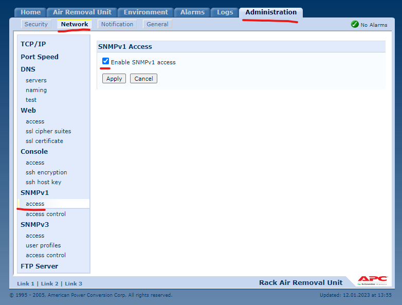
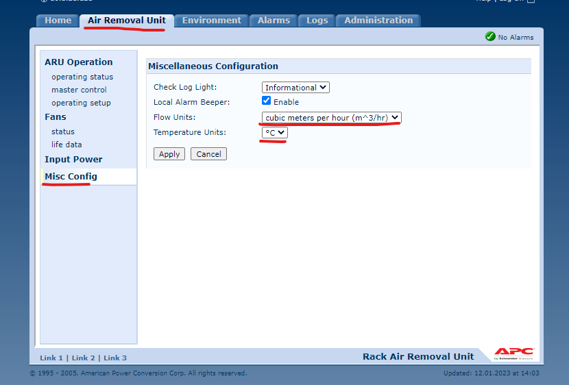

# Zabbix Template APC RARU monitoring

## Overview
For Zabbix version: 6.2 and higher.

SNMP is using for APC RARU monitoring.

Some triggers using preconfigured threshold, probably you should adjust this settings for your environment.

The template is developed for monitoring singe RARU with no or multiply sensors:
* Overall RARU state
* Temperatures
* Overall fans state

LLD using for fans and sensors discovery.

This template was tested on:
* APC RARU with 1 sensor and 4 fans installed

## Setup
Enable SNMP on target device:

Adjust units:

## Author

Aleksey Volodin

## Macros used

Default macros values should be adjusted according your environment.

|Macro|Value|Description|
|-----|-----|-----|
|{$APC.RARU.MONOINC.TIME}|20m|Threshold for temperature mono increasing time.|
|{$APC.RARU.TEMPERATURE.TREACHOLD.CRIT}|35||
|{$APC.RARU.TEMPERATURE.TREACHOLD.INFO}|25||
|{$APC.RARU.TEMPERATURE.TREACHOLD.WARN}|30||

## Template links

There are no template links in this template.

But you probably should attach basic ICMP and SNMP monitoring templates for overall availability checks.

## Discovery rules

|Name|Description|Type|Key and additional info|
|----|-----------|----|----|
|Fans discovery|Discover all fans|SNMP Agent|fans.discovery|
|Sensors discovery|Discover all sensors|SNMP Agent|sensors.discovery|

## Items collected

* Auxiliary AC state
* Delta temperature
* Exhaust Temperature
* Exhaust temperature 1
* Exhaust temperature 2
* Exhaust temperature 3
* Master ARU state
* Primary AC state
* Sensors temperature
* Status
* Total air flow
* Fans speed
* Fans state
* Fans usage in %
* Sensors high threshold
* Sensors location
* Sensors low threshold
* Sensors max threshold
* Sensors temperature

## Triggers

There are no triggers in this template.

* ARU turned off
* ARU working without AC input redundancies
* Status not optimal
* Fans state not optimal
* Sensors temperatures with different thresholds
